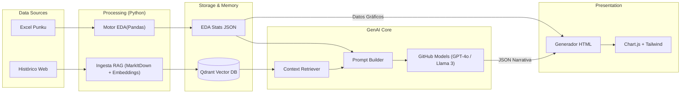

# Stack Tecnológico y Arquitectura

## 1. Visión General de la Arquitectura

La solución sigue un patrón de **Generación Aumentada por Recuperación (RAG)** híbrida, donde se combina la precisión de datos estructurados (Excel) con la capacidad semántica de datos no estructurados (noticias históricas).

### Diagrama de Flujo de Datos

## 2. Componentes del Stack

### 2.1. Procesamiento Numérico (EDA)
*   **Tecnología:** Python 3.10+, Pandas, NumPy.
*   **Función:** Ingesta del dataset oficial de portabilidad (Punku). Realiza limpieza, transformación de series temporales y cálculo de métricas complejas (variaciones porcentuales, saldo neto por operador).
*   **Por qué:** Los LLMs no son fiables para cálculos aritméticos precisos. Esta capa garantiza que "2 + 2 = 4" antes de que el modelo intente escribirlo.

### 2.2. Base de Datos Vectorial (RAG)
*   **Tecnología:** **Qdrant**.
*   **Función:** Almacena embeddings de noticias históricas de OSIPTEL.
*   **Justificación de Qdrant:**
    *   **Filtrado Híbrido:** Permite buscar vectores similares restringidos por metadatos (ej: `month="January"`, `year="2024"`). Esto es crítico para el caso de uso "comparar con el mismo mes del año anterior".
    *   **Eficiencia:** Implementación en Rust, extremadamente rápida y ligera para despliegue local o en contenedor.
    *   **Flexibilidad:** Funciona en modo *embedded* (en disco) para desarrollo y *server* para producción sin cambiar código.

### 2.3. Modelos de Lenguaje (LLM)
*   **Tecnología:** GitHub Models (acceso a GPT-4o, Llama 3, Phi-3).
*   **Función:** Recibe los datos calculados (JSON) y los fragmentos de texto recuperados (RAG) para redactar la noticia final.
*   **Configuración:** Se utiliza `response_format={"type": "json_object"}` para garantizar que la salida sea estructurada y programáticamente consumible por el frontend.

### 2.4. Frontend y Visualización
*   **Tecnología:** HTML5, **Tailwind CSS**, **Chart.js**.
*   **Función:** Plantilla estática que renderiza los datos.
*   **Por qué:** Desacopla la presentación de la lógica. Chart.js renderiza gráficos interactivos en el cliente usando los datos exactos del EDA, evitando generar imágenes estáticas que podrían perder calidad o interactividad.

### 2.5. Serving y Orquestación (Siguientes Pasos)
*   **FastAPI:** Se utilizará para exponer el pipeline como una API REST (`POST /generate`), permitiendo la integración con otros sistemas o interfaces de usuario.
*   **Docker:** Contenerización de la aplicación y la base de datos Qdrant para un despliegue reproducible.

## 3. Decisiones de Diseño Clave

1.  **Datos Determinísticos en el Prompt:** No le pedimos al LLM que cuente filas ni sume columnas. Le pasamos el resultado final: *"Claro ganó 15,000 líneas"*. El LLM solo debe decidir cómo contarlo elegantemente.
2.  **RAG "Period-Aware":** La recuperación no es solo por similitud semántica. Si generamos el reporte de Enero 2025, el sistema fuerza la búsqueda de contexto en Enero 2024 y Diciembre 2024 para dar continuidad narrativa.
